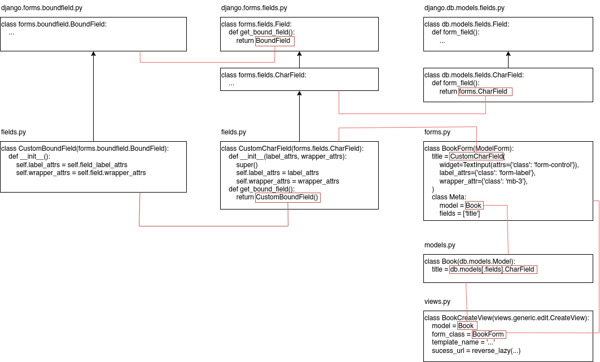

# Bootstrap form with Django

## Introduction

Django forms let you put classes on widget, but not on label, so that it can be difficult to use Django with the CSS framework Bootstrap, which requires classes to be put on `input`, `select`, etc. elements but also on labels, even sometimes on wrapping `div` elements.

Furthermore it can be difficult to dynamically place `.is-valid` and `.is-invalid` classes on `input` elements when errors are detected in the form.

The solution is to create custom form field (derived from `forms.Field`s) that accepts `label_attrs` and `wrapper_attrs` as constructor parameters, like that:

```python
class BookForm(ModelForm):
    title = CustomCharField(
        widget=TextInput(attrs={'class': 'form-control'}),
        label_attrs={'class': 'form-label'},
        wrapper_attrs={'class': 'mb-3'},
    )
```

This project is an example of such a trick.

## How it works?

### Custom form field

The first thing to do is to create a derivate from `forms.Field`, for example a custom char field:

```python
class CustomCharField(forms.CharField):
    def __init__(
            self,
            *,
            label_attrs=None,
            wrapper_attrs=None,
            **kwargs):
        super().__init__(**kwargs)
        self.label_attrs = label_attrs
        self.wrapper_attrs = wrapper_attrs

    def get_bound_field(self, form, field_name):
        return CustomBoundField(form, self, field_name)
```

### Custom bound field

Note that when you use the field in a template, like that:

```html

  {{ field.label }}

```

`field` is not a `[Custom]CharField`, but a `BoundField` on which `[Custom]CharField` properties like `label` are reported.

These is why we need to overwrite the `get_bound_field` method to return a custom bound field, defined as follows:

```python
class CustomBoundField(BoundField):
    def __init__(self, form, field, name):
        super().__init__(form, field, name)
        for attr in ('label_attrs', 'wrapper_attrs'):
            if (hasattr(self.field, attr)
                    and getattr(self.field, attr) is not None):
                setattr(self, attr, getattr(self.field, attr).copy())
            else:
                setattr(self, attr, dict())

    def as_widget(self, widget=None, attrs=None, only_initial=False):
        widget = widget or self.field.widget
        classes = widget.attrs.get('class', "").split()
        if self.form.is_bound:
            if self.errors:
                validation_class = "is-invalid"
            else:
                validation_class = "is-valid"
            widget.attrs['class'] = " ".join(classes + [validation_class])
        return super().as_widget(widget, attrs, only_initial)
```

This also allows us to dynamically set the `.is-valid` and `.is-invalid` classes on the widget according to the validation status of the field. We do that when the widget is created (it's the best place I have found, you could also do that when the form is validated, for example).

Of course, you can't set these classes when defining the `[Model]Form`, since they can only be set when the form is bound (that is, has data to be validated, so when the user has submitted it) and they depend on the validation status of the field.


### Using it in the form

Now you can use it in a `[Model]Form`, like that:

```python
class BookForm(ModelForm):
    title = CustomCharField(
        widget=TextInput(attrs={'class': 'form-control'}),
        label_attrs={'class': 'form-label'},
        wrapper_attrs={'class': 'mb-3'},
    )
    class Meta:
        model = Book
        field = ['title']
```

Of course, you need to match the `db.models.Field` to the `forms.Field`, for example a `db.models.CharField` to a `CustomCharField` (and not a `CustomIntegerField`). To see what is the default defined by Django, you can explore the `db.models.Field` derived classes, especially the `formfield` method.

### In the template

You can write snippets like that:

```html
<div>
  <label for="{{ field.id_for_label }}">{{ field.label }} *</label>
{{ field }}
  
    <small class="form-text">{{ field.help_text }}</small>
  

</div>
```

(see the files `attrs.html` and `errors.html` form more details) and use them in your template like that:

```html
<form action="." method="POST">
  
  
    
  
  <button type="submit">create</button>
</form>
```

## Diagram


